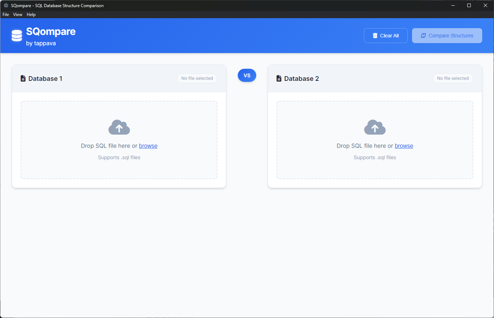

# SQompare

A modern, cross-platform SQL database structure comparison tool built with Electron.

You didn't work as you should an now you Databases differ from each other? This tool will save your ass.




## Features

- 🔍 **Compare SQL Database Structures** - Import and compare two SQL database structure files
- 📊 **Visual Comparison** - Modern, intuitive interface showing differences clearly
- 🏗️ **Generate CREATE TABLE Queries** - Automatically generate CREATE TABLE statements for missing tables
- 🔧 **Generate ALTER Queries** - Automatically generate ALTER TABLE statements for missing columns
- 📱 **Cross-Platform** - Runs on Windows, macOS, and Linux
- 🎨 **Modern UI** - Clean, responsive design with dark mode support
- 📁 **File Support** - Drag-and-drop or browse to import .sql files
- 📋 **Export Reports** - Save comparison results as SQL files
- 👁️ **Detailed Table View** - Click to view complete structure of missing tables

## Installation

### Download Pre-built Releases

Download the latest release for your platform from [GitHub Releases](https://github.com/tappava/SQompare/releases):

- **Windows**: `SQompare-Setup-1.2.1.exe` (installer) or `SQompare-1.2.1.exe` (portable)
- **macOS**: `SQompare-1.2.1.dmg` (should work, I don't have a macOS device and your overlords don't allow to build it somewhere else)
- **Linux**: `SQompare-1.2.1.AppImage` (portable) or `SQompare-1.2.1-x86_64.flatpak` (Flatpak package)

#### Installing on Linux

**AppImage (Recommended for most users):**
```bash
# Make executable and run
chmod +x SQompare-1.2.1.AppImage
./SQompare-1.2.1.AppImage
```

**Flatpak:**
```bash
# Install the Flatpak package
flatpak install SQompare-1.2.1-x86_64.flatpak

# Run SQompare
flatpak run com.sqompare.app
```

### Development Setup

#### Prerequisites

- Node.js (v16 or higher)
- npm or yarn

#### Setup

1. Clone or download this repository
2. Navigate to the project directory
3. Install dependencies:

```bash
npm install
```

## Usage

### Development

Run the app in development mode:

```bash
npm run dev
```

### Building

#### Local Development

Build the application for your platform:

```bash
# Build for current platform
npm run build

# Build for specific platforms
npm run build:win              # Windows (exe installer & portable)
npm run build:mac              # macOS (dmg)
npm run build:linux            # Linux (both AppImage and Flatpak)
npm run build:linux-appimage   # Linux AppImage only
npm run build:linux-flatpak    # Linux Flatpak only (requires Linux system)
```

#### Automated Builds (GitHub Actions)

This project uses GitHub Actions to automatically build releases for all platforms:

- **Windows builds**: Built on Windows runners
- **Linux AppImage**: Built on Ubuntu runners (cross-platform compatible)
- **Linux Flatpak**: Built on Ubuntu runners with Flatpak installed
- **Releases**: Automatically created when pushing version tags (e.g., `v1.0.0`)

#### Build Requirements

- **Windows builds**: Can be built on Windows, macOS, or Linux
- **macOS builds**: Must be built on macOS (requires Xcode)
- **Linux AppImage**: Can be built on any platform
- **Linux Flatpak**: Must be built on Linux (requires Flatpak runtime)

#### Build Outputs

- **Windows**: Creates both installer and portable executables in `dist/`
- **macOS**: Creates DMG package in `dist/`
- **Linux**: Creates AppImage and/or Flatpak packages in `dist/`

#### Manual Linux Building

**For AppImage (works on any platform):**
```bash
npm run build:linux-appimage
```

**For Flatpak (Linux only):**
```bash
# Install Flatpak and flatpak-builder (Ubuntu/Debian)
sudo apt install flatpak flatpak-builder

# Install Flatpak and flatpak-builder (Fedora)
sudo dnf install flatpak flatpak-builder

# Then build the Flatpak package
npm run build:linux-flatpak
```

#### Creating Releases

To create a new release with automated builds:

1. Update the version in `package.json`
2. Create and push a version tag:
   ```bash
   git tag v1.0.0
   git push origin v1.0.0
   ```
3. GitHub Actions will automatically build all platforms and create a release

# Then build the Linux package
npm run build:linux


### How to Use

1. **Import SQL Files**: Use the drag-and-drop areas or browse buttons to import two SQL database structure files
2. **Compare**: Click the "Compare Structures" button to analyze differences
3. **Review Results**: View missing tables, columns, and matching structures in the results section
4. **View Table Details**: Click the "View" button next to missing tables to see their complete structure
5. **Generate CREATE Queries**: Switch to the "CREATE Tables" tab to see the generated CREATE TABLE statements
6. **Generate ALTER Queries**: Switch to the "ALTER Queries" tab to see the generated ALTER TABLE statements
7. **Export**: Save the comparison report or copy queries to clipboard

## Supported SQL Features

- CREATE TABLE statements
- Column definitions with data types
- NULL/NOT NULL constraints
- DEFAULT values
- AUTO_INCREMENT columns
- Primary keys and indexes (basic support)

## File Structure

```
SQompare/
├── src/
│   ├── main.js          # Electron main process
│   ├── preload.js       # Preload script for security
│   ├── index.html       # Main application HTML
│   ├── styles.css       # Application styles
│   ├── app.js           # Main application logic
│   ├── sql-parser.js    # SQL parsing and comparison logic
│   └── assets/          # Application assets
├── package.json         # Project configuration
└── README.md           # This file
```

## Technologies Used

- **Electron** - Cross-platform desktop app framework
- **HTML/CSS/JavaScript** - Frontend technologies
- **Node.js** - Backend runtime
- **electron-builder** - Application packaging

## Contributing

1. Fork the repository
2. Create a feature branch
3. Make your changes
4. Test thoroughly
5. Submit a pull request

## License

MIT License - see LICENSE file for details

## Support

For issues, questions, or feature requests, please create an issue in the project repository.

---

**SQompare** - Making database structure comparison simple and elegant.

